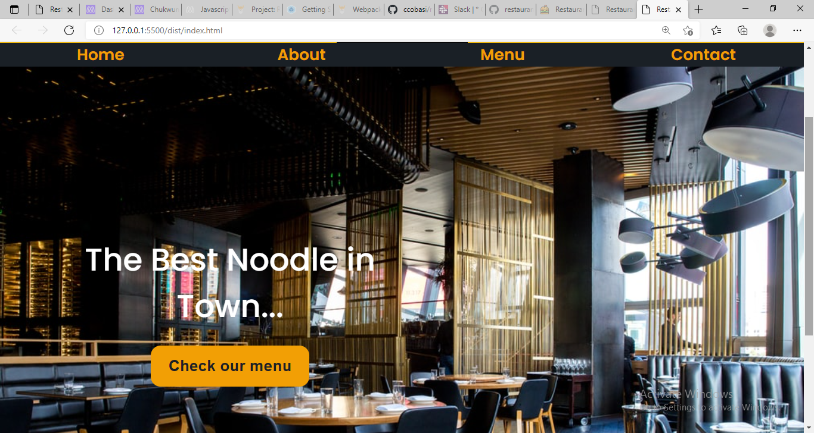

## restaurant
 This project comes after the introduction of the ES6 class keyword, ES6 modules, and webpack. The main goal of this project is for the student to show the understanding of the benefits of modularized code as well as the ability to set up a javascript application made of different modules using webpack.

 ## Screen shot of Page

 ## Page live Demo Link

 [link!](https://flamboyant-ptolemy-e38460.netlify.app/)

 ## Built With

 - Only Javascript 
 - Webpack
 - Used the DOM Manipulation.
 - CSS
 - Images
 - Linters

 ## How It work 
  - First Open Your terminal and paste : git clone git@github com:ccobasi/restaurant.git.

  - Thene cd to the Folder && Open it in your Texteditor.

  - To Make the website fully working make sure to install the webpack
  and run the folowing command if yoy don't have it.

  ## Author

  - Github (@ccobasi)  [Chukwuma](www.github.com/ccobasi)
  - twitter (@obasichux)  [obasichux](www.twitter.com/obasichux)
  - linkedIn (@chukwuma-obasi)  [chukwuma](https://www.linkedin.com/in/chukwuma-obasi/)

 ## Feedback

 - Give A  thumb-up 👍 if you like it.

 ## License 

 - This project is MIT license

